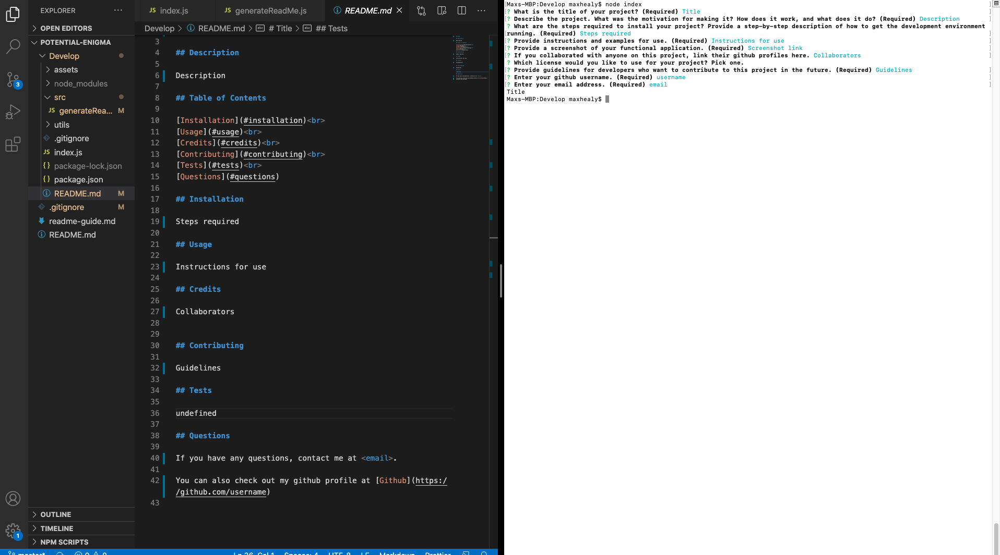

# README

## Description

No
<No>

## Table of Contents

* [Installation](#installation) 
* [Usage](#usage) 
* [Contributing](#contributing) 
* [Tests](#tests) 
* [Questions](#questions)

## Installation

No

## Usage

NO

## Contributing

Guidelines

## Tests

tests

## Questions

If you have any questions, contact me at <maxhealy01@gmail.com>.

You can also check out my github profile at [Github](https://github.com/maxhealy01)

## License
  
  Licensed under the Apache License 2.0.
    